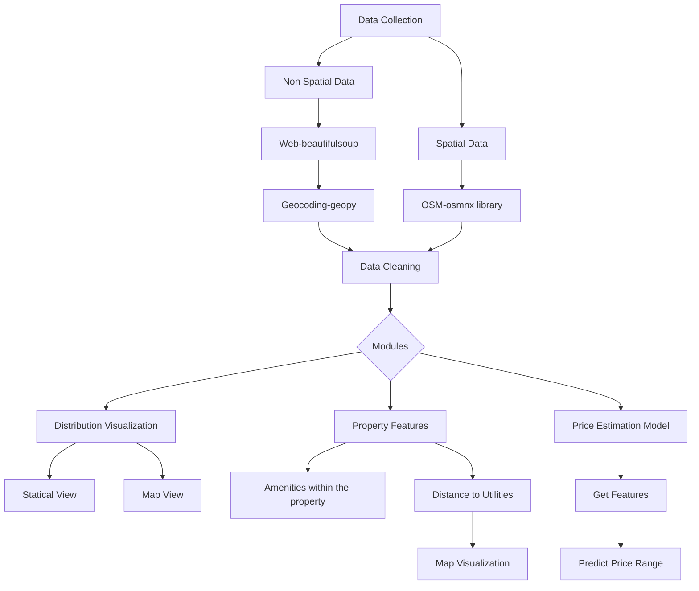

# Spatial Tool for Property Search in Nairobi, Kenya

## Project Summary
- Web Scraping using baeutifulsoup
- OSM data download using osmnx
- Geocoding addresses using geopy
- Data Cleaning using pandas
- Data Enconding using scikit-learn
- Data visualization using seaborn, matplotlib & Folium
- Spatial analysis using geopandas
- Building model using scikit-learn
## Data Collection
### Web Scraping
Properties data were fetched from the web using beautifulsoup library. Data obtained include property name, amenities within the property and its address.
### Downloading OpenStreetMap Data
Seven categories of utulities within Nairobi were downloaded from openstreetmap using osmnx libray. They include;
- Schools
- Hospitals
- Shopping Malls
- Pharmacies
- Police Stations
- Place of Worship
- Gas Stations

## Conversion of Property data into spatial data
### Geocoding
Data transformation from non-spatial to spatial data. Geopy library was used to geocode addresses of properties. Nominatim geocoder which is an openstreetmap API was utilized for the exercise. More than 95% of the data were assigned xy coordinates.
## Data Cleaning & Encoding
- Drop null values
- Encoding categorical attributes using OneHotEncoder
- Editing addresses that were not geocoded
- Droping data that are not realistic e.g a three bedroom house with a price of Ksh.60,000 or A property with a name stating that it's a 4 bedroom but attributes reads 5 bedrooms.
## Methodology

## Project Modules

### 1. Filter Module
This module allows the user to view properties within a specif region of interest. The module displays statistics based on the number of bedrooms of each available house in a bar chart. The same properties are displayed on a map.

### 2. Property Features Module
This module is more specific to individual property. It involves filtering a specific property within a specific region. There are two output in this module;
- Attributes within the property e.g the number of bedrooms, availability of alarm, generator, parking bay e.t.c.
- Distance to the nearest utilities e.g how far is the nearest shopping mall, school, Gas station, hospital e.t.c.

These data might be useful for someone who wants to purchase the property, especiallly data related with the spatial location of commonly needed utilities.

### 3. Price Estimation Module
This is a machine learning module whereby the user provides features of the property he/she would like to purchase, then the program predicts price range of the property based on those features.
