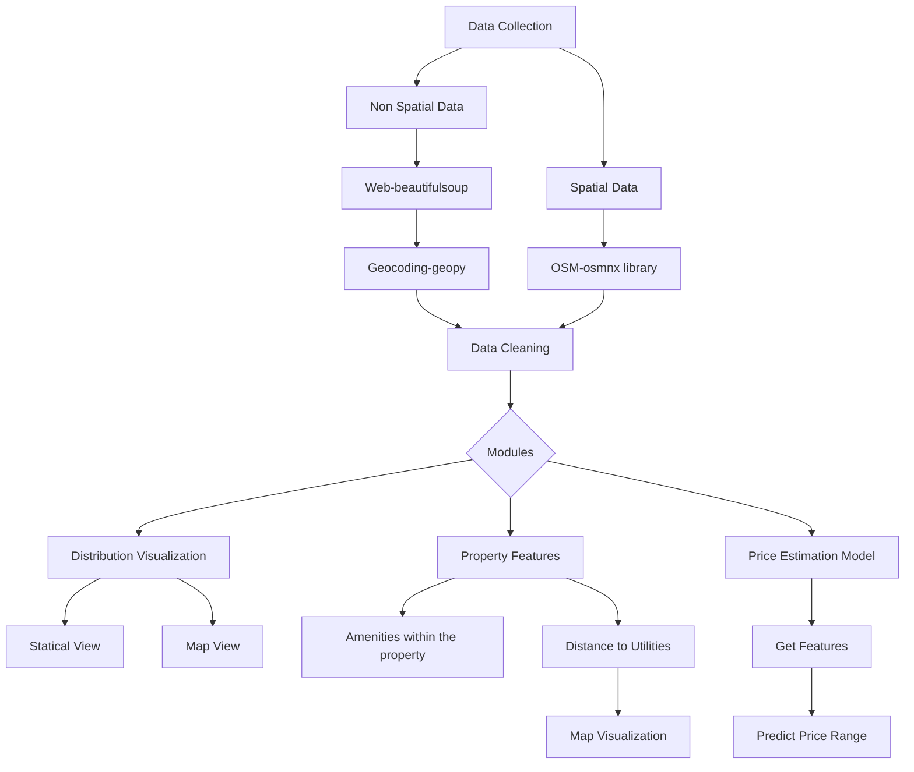

# Spatial Tool for Property Search

### Methodology

```mermaid
graph TD;
    A[Data Collection]-->B[Spatial Data];
    A-->C[Non Spatial Data];
    C-->D[Web-beautifulsoup];
    B-->E[OSM-osmnx library];
    D-->F[Geocoding-geopy]
    F-->G[Data Cleaning];
    E-->G;
    G-->H{Modules}
    H-->I[Distribution Visualization]
    H-->J[Property Features]
    H-->K[Price Estimation Model]
    I-->L[Statical View]
    I-->M[Map View]
    J-->N[Amenities within the property]
    J-->O[Distance to Utilities]
    O-->P[Map Visualization]
    K-->Q[Get Features]
    Q-->R[Predict Price Range]
```
